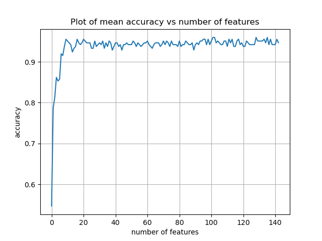
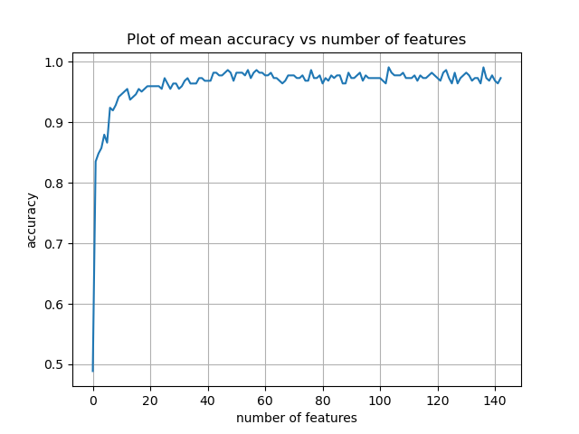

# 🥤 Cup Water-Level Detection from Pouring Sound

> Predicting **how full a cup is** — and **how fast it is being filled** — purely from the **sound of water being poured**, using classical machine learning (no deep learning).

When you pour water into a cup, the pitch rises as the cup fills: the air column above the water shortens and resonates higher. This project turns that everyday acoustic cue into a measurable signal and asks a machine-learning model to read it.

---

## 🎯 Concept

A water bar fills cups by hand. As a cup fills, the pouring sound changes in a consistent, physically-grounded way. The goal of this project is a **proof-of-concept** that this change can be decoded automatically:

1. **Fill-level classification** — given a recording of a pour, predict the fill level (20 / 40 / 60 / 80 / 100 %).
2. **Flow-rate regression** — predict the continuous pouring rate in **mL/s** directly from the sound.

The intended downstream use is a "stop pouring" assistant, so real-time inference is **not** required — the focus is on whether the acoustic information is there and how reliably classical models can extract it.

---

## 🎙️ Data Collection

Recordings were captured under deliberately controlled conditions to isolate the fill signal:

| Control | Choice |
|---|---|
| Flow rate | Single tap, uniform flow |
| Cups | 3 cups of different sizes — **300 mL, 350 mL, 400 mL** |
| Start state | Always an empty cup |
| Liquid | Water only |
| Microphone | Fixed distance, quiet environment |

**Dataset:** a perfectly balanced **225 recordings** — 3 cups × 5 fill levels × 15 repetitions each. Pour durations range from ~1.4 s to ~20 s.

---

## 🔊 From Sound to Features

Each recording is split into **5 equal time windows**, so the model sees how the sound *evolves* during the pour rather than a single averaged snapshot. For every window we extract a compact set of acoustic descriptors:

- **Spectral shape** — centroid, roll-off, bandwidth, flatness
- **Energy & texture** — RMS energy, zero-crossing rate, harmonic / percussive ratio
- **Pitch cues** — dominant frequency and its magnitude
- **Dynamics** — onset count, attack time, sustain level, frame-to-frame deltas
- **Timbre** — 13 **MFCC** coefficients

This yields **145 features per recording** (5 windows × 29 descriptors), plus the pour duration. Extraction is done with [`librosa`](https://librosa.org/) in `Recordings_to_Dataset.py`.

---

## 🧠 Method

A clean, classical-ML pipeline, kept honest at every step:

1. **Feature ranking** — ANOVA F-scores to see which acoustic features separate the fill classes.
2. **Feature selection** — wrapper selection (forward / backward) and filter selection (`SelectKBest`), evaluated *inside* cross-validation so no fold ever sees its own test rows during preprocessing.
3. **Models** — `XGBoost` and `RandomForest`, plus a **probability-averaging ensemble**.
4. **Tuning** — `GridSearchCV` over depth, estimators, learning rate, subsampling — on the **training split only**.
5. **Validation** — repeated **stratified k-fold cross-validation** (4 folds × 5 repeats), with leakage-free preprocessing baked into each fold (`Cross_Validation_Clean.py`).

Because the fill levels are **ordered** (20 < 40 < 60 < 80 < 100), we report ordinal-aware metrics alongside accuracy:

- **Adjacent accuracy** — fraction of predictions within ±1 fill level.
- **Quadratic-weighted kappa** — penalizes far misses more than near ones.

### How many features do we actually need?

Adding features in ANOVA-rank order shows accuracy climbing steeply and then **plateauing after only ~10–20 features** — the acoustic signal is concentrated in a handful of descriptors, and the long tail adds little. This is what justifies trimming the 145-feature set.

| XGBoost | RandomForest |
|---|---|
|  |  |

---

## 📊 Results

### Cross-validation: XGBoost vs RandomForest

Stratified 4-fold CV — mean score per metric (left) and the per-fold accuracy spread (right). RandomForest edges ahead on the mean, but both models sit comfortably in the high-0.9s and the fold-to-fold variation is small.


### Fill-level classification — *same cups seen in training*

Leak-free repeated stratified k-fold CV (4 folds × 5 repeats):

| Model | Accuracy | Adjacent acc. | Quadratic κ |
|---|---|---|---|
| XGBoost | 0.959 ± 0.027 | **1.000** | 0.990 |
| RandomForest | **0.974 ± 0.021** | **1.000** | 0.994 |
| Ensemble (50/50) | 0.969 ± 0.025 | **1.000** | — |

➡️ ~**96–97 % exact accuracy**, and **every single error is off by at most one fill level** — the model is never badly wrong.

#### Confusion matrices (held-out test split, 45 samples)

On a single held-out 20 % split, XGBoost makes exactly one off-by-one error (an 80 % pour read as 100 %); RandomForest and the ensemble are perfect on this split.

| XGBoost | RandomForest | Ensemble |
|---|---|---|
|  |  |  |

Combined-model classification report:


### Fill-level classification — *brand-new, unseen cup* (leave-one-cup-out)

The harder, more honest test: train on 2 cups, predict the 3rd cup the model has **never heard**.

| Held-out cup | Exact accuracy | Adjacent accuracy |
|---|---|---|
| Cup 1 (300 mL) | 0.827 | 1.000 |
| Cup 2 (350 mL) | 0.467 | 1.000 |
| Cup 3 (400 mL) | 0.573 | 0.987 |

➡️ Exact accuracy drops on a fully unseen cup, **but adjacent accuracy stays ~0.99–1.00** — predictions remain within one fill bucket even when the cup is new.

### Flow-rate regression (mL/s)

A regressor (best of XGBoost / RandomForest by CV R²) predicts the continuous flow rate directly from the audio. Left: mean true vs predicted rate per fill class. Right: per-sample predicted vs true, colored by cup, against the `y = x` perfect-agreement line.


5-fold CV R²:

| Feature set | XGBoost | RandomForest |
|---|---|---|
| Sound **+ duration** | **0.846** | 0.784 |
| Sound **only** (no duration) | 0.834 | 0.778 |

➡️ Removing pour duration barely changes the score (0.846 → 0.834): **the pouring sound alone carries the flow-rate information.** The scatter shows the model tracks the rate well across cups, with the largest cup (Cup 3, fastest pours) slightly under-predicted at the high end.

---

## 💡 Conclusions & Insights

- **The acoustic signal is real and strong.** Fill level is recoverable from sound with ~96–97 % accuracy on seen cups, and the rising-pitch physics shows up clearly in the spectral features.
- **Errors respect the ordering.** Across every experiment, mistakes are almost always neighbours (±1 level). This is exactly the failure mode you want for a "nearly full → stop" application.
- **Generalizing to a new cup is the real challenge.** A random split flatters the model because each cup has its own acoustic fingerprint; the leave-one-cup-out test reveals that exact-level prediction on an unseen cup is much harder. *More importantly, this means the honest evaluation is leave-one-cup-out, not a random split.*
- **Sound beats arithmetic for flow rate.** A model trained directly on the audio predicts flow rate well even without being told the pour duration — evidence the sound itself encodes the rate.
- **The path to robustness is more cups.** The single biggest lever for real-world performance is recording many more cup sizes and materials, so the model learns the *physics* of filling rather than the *identity* of three specific cups.

---

## 📁 Repository Structure

```
.
├── Recordings_to_Dataset.py      # Audio → 145 librosa features → cup_dataset.csv
├── cup_dataset.csv               # 225 recordings × 145 features (+ Cup, Fill, duration_s)
│
├── Data_Loader.py                # Load, preprocess, splits (random / leave-one-cup-out), scaling, ANOVA
├── Model_Builder.py              # XGB & RF builders, forward/backward feature selection, GridSearch tuning
├── Model_Validation.py           # Stratified & group k-fold cross-validation
├── Cross_Validation_Clean.py     # Leak-free, cup-balanced, repeated CV with ordinal-aware metrics
├── Model_Test.py                 # Evaluation, ensemble, feature importance, single/batch predict
├── Model_Saving.py               # Pickle save / load
├── Graph_results.py              # ANOVA, confusion-matrix, CV-comparison & flow-rate plots
│
├── Flow_Rate.py                  # Flow-rate regression wired into the main pipeline
├── Flow_Rate_Regression.py       # Standalone flow-rate regression (sound + duration)
├── Flow_Rate_Regression_SoundOnly.py  # Standalone flow-rate regression (sound only)
│
└── Model_Pipeline.py             # End-to-end orchestration (entry point)
```

---

## 🚀 Getting Started

```bash
# Install dependencies
pip install numpy pandas scikit-learn xgboost librosa matplotlib seaborn scipy

# (1) Build the dataset from raw recordings  (folders named "<cup> - <fill>")
python Recordings_to_Dataset.py

# (2) Run the full classification + flow-rate pipeline
python Model_Pipeline.py
```

> ℹ️ Point `CSV_PATH` in `Model_Pipeline.py` to your local `cup_dataset.csv` before running.

---

## 🔭 Future Work

- Record **many more cups** (sizes *and* materials) to push past cup-identity overfitting.
- Test robustness to background noise, microphone distance, and non-uniform flow.
- Explore a lightweight real-time "stop pouring" trigger built on the regression model.

---

## 🧪 Method Notes

- All preprocessing (scaling + feature selection) is fit **inside** each CV fold to prevent leakage.
- Hyperparameter tuning uses the **training split only**; the test set stays untouched until final evaluation.
- Per project guidelines: **classical machine learning only — no deep learning.**
